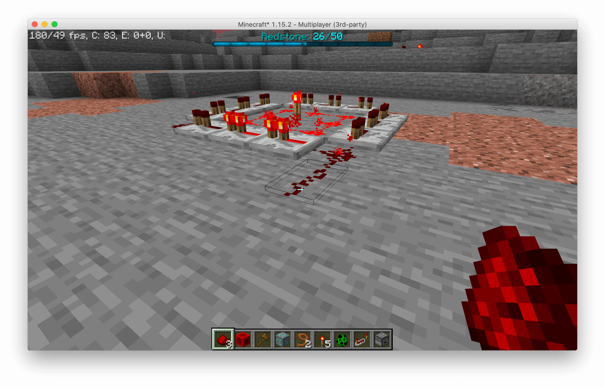
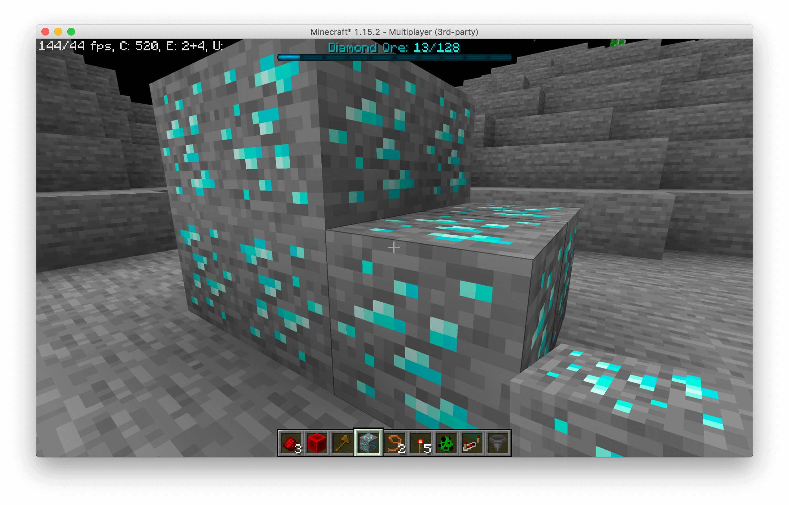
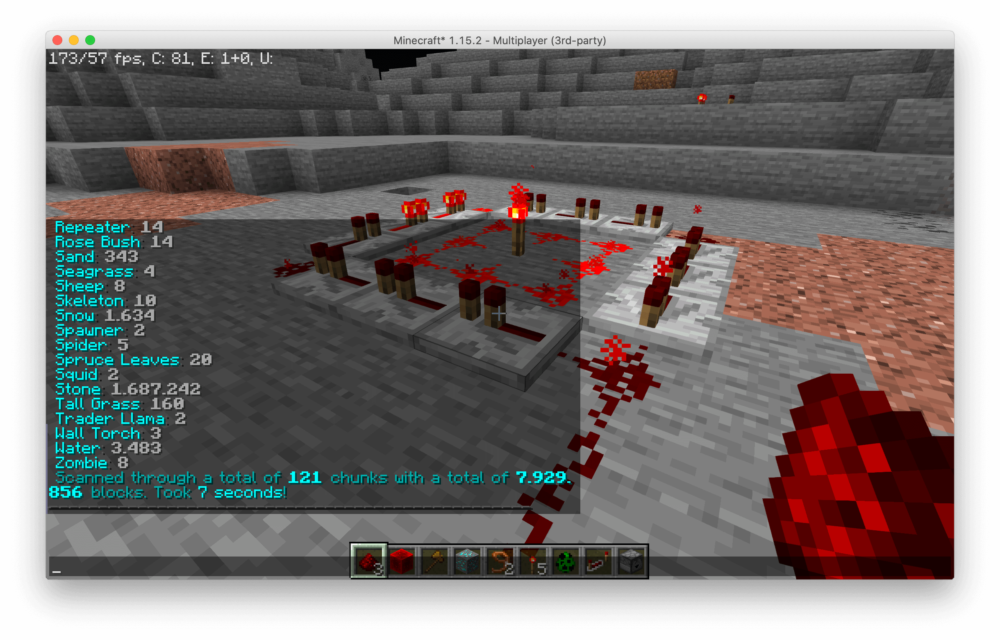
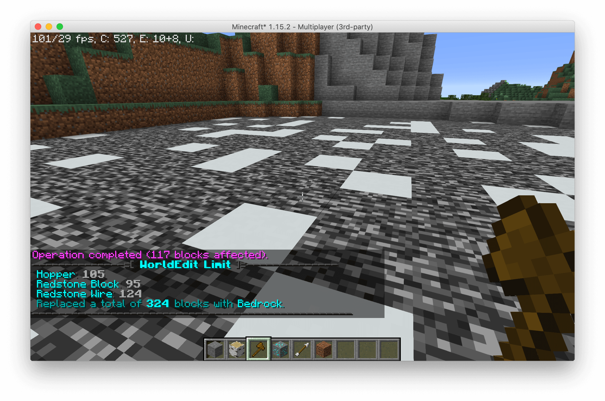
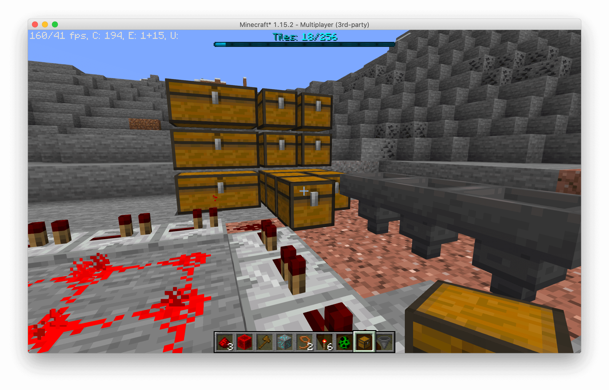
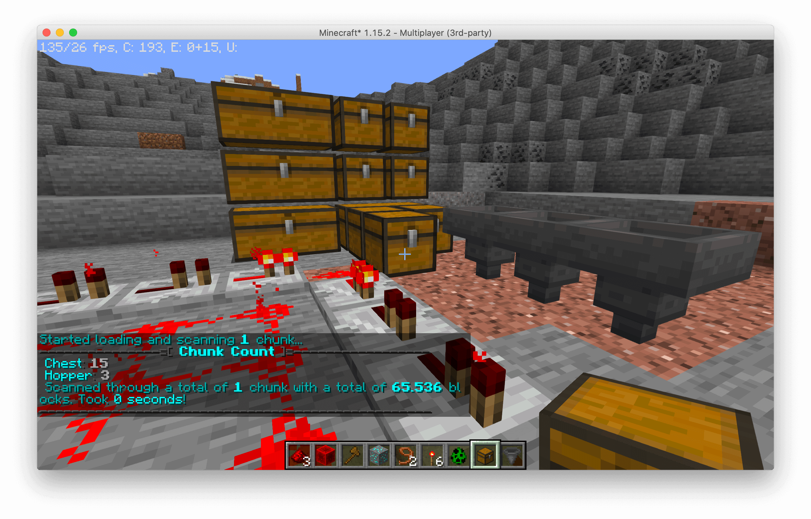
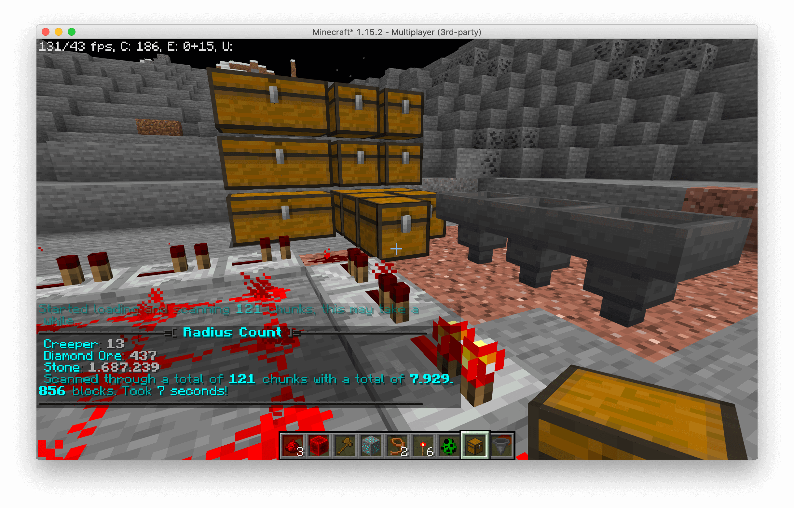
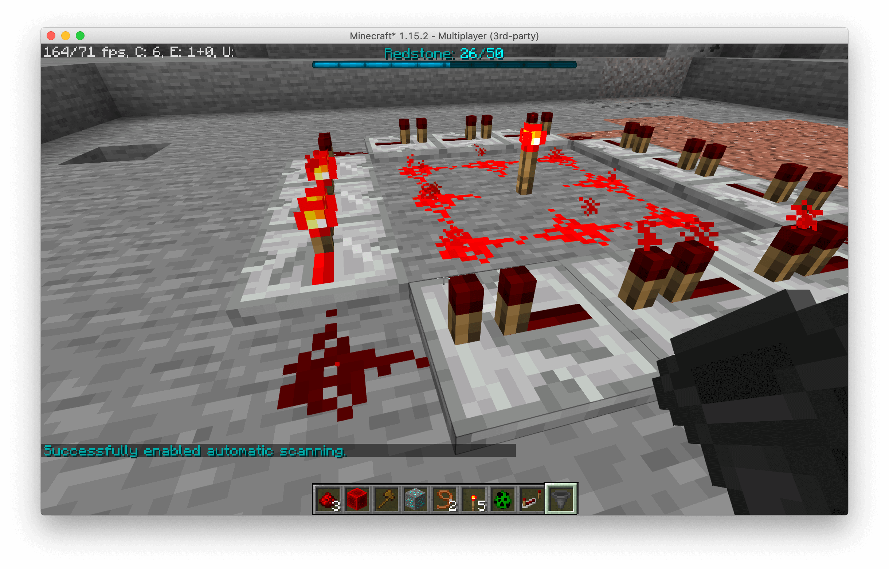
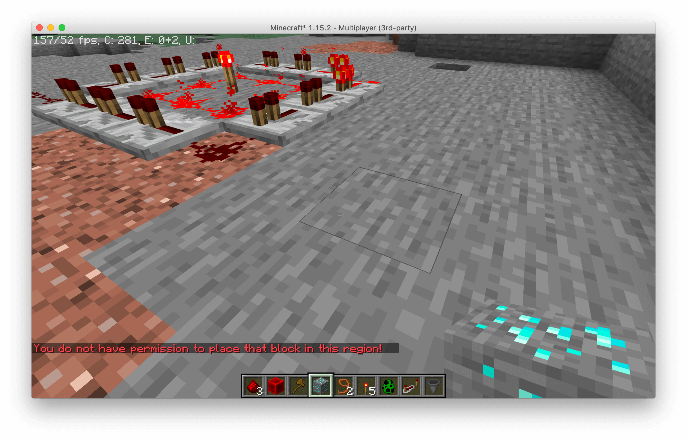

<!-- Variables (this block will not be visible in the readme -->
[spigot]: https://www.spigotmc.org/resources/56489/
[spigotRatingImg]: https://img.shields.io/badge/dynamic/json.svg?color=brightgreen&label=rating&query=%24.rating.average&suffix=%20%2F%205&url=https%3A%2F%2Fapi.spiget.org%2Fv2%2Fresources%2F56489
[spigotDownloadsImg]: https://img.shields.io/badge/dynamic/json.svg?color=brightgreen&label=downloads%20%28spigotmc.org%29&query=%24.downloads&url=https%3A%2F%2Fapi.spiget.org%2Fv2%2Fresources%2F56489
[issues]: https://github.com/FrankHeijden/Insights/issues
[wiki]: https://github.com/FrankHeijden/Insights/wiki
[release]: https://github.com/FrankHeijden/Insights/releases/latest
[releaseImg]: https://img.shields.io/github/release/FrankHeijden/Insights.svg?label=github%20release
[license]: https://github.com/FrankHeijden/Insights/blob/master/LICENSE
[licenseImg]: https://img.shields.io/github/license/FrankHeijden/Insights.svg
[bugReports]: https://github.com/FrankHeijden/Insights/issues?q=is%3Aissue+is%3Aopen+label%3Abug
[bugReportsImg]: https://img.shields.io/github/issues/FrankHeijden/Insights/bug.svg?label=bug%20reports
[reportBug]: https://github.com/FrankHeijden/Insights/issues/new?labels=bug&template=bug.md
[featureRequests]: https://github.com/FrankHeijden/Insights/issues?q=is%3Aissue+is%3Aopen+label%3Aenhancement
[featureRequestsImg]: https://img.shields.io/github/issues/FrankHeijden/Insights/enhancement.svg?label=feature%20requests&color=informational
[requestFeature]: https://github.com/FrankHeijden/Insights/issues/new?labels=enhancement&template=feature.md
[config]: https://github.com/FrankHeijden/Insights/blob/master/resources/config.yml
[gradleInstall]: https://gradle.org/install/
[bStatsImg]: https://bstats.org/signatures/bukkit/Insights.svg
[bStats]: https://bstats.org/plugin/bukkit/Insights/7272
<!-- End of variables block -->

# Insights
Insights is a plugin which scans arbitrary regions and applies block limitations on them. 
Insights' limits are super configurable, allowing for group limits, individual (permission-based) limits, and tile limits.
Each limit is able to be bypassed through permissions, which you can customize in the limits configuration.

Apart from all placeable materials, Insights also supports the limitation of the following static entities:
* Item Frames
* Glow Item Frames
* Armor Stands
* Paintings
* End Crystals

Insights applies a mapreduce design pattern to perform scans asynchronously,
thus keeping the main thread free from counting materials.
Insights also provides an extensive developer API to create your own custom defined region addons,
or to perform arbitrary scans and process those.

For a full description of this plugin, please refer to SpigotMC: https://www.spigotmc.org/resources/56489/

[](https://github.com/FrankHeijden/Insights/actions)
[](https://jitpack.io/#FrankHeijden/Insights)
[![releaseImg]][release]
[![licenseImg]][license]
[![featureRequestsImg]][featureRequests]
[![bugReportsImg]][bugReports]
[![spigotRatingImg]][spigot]
[![spigotDownloadsImg]][spigot]

[](https://discord.gg/WJGvzue)

[![bStatsImg]][bStats]

## Extensions
These plugins are extensions on Insights, they must be placed in your `plugins/` folder.
* [InsightsWorldEditExtension](https://github.com/InsightsPlugin/InsightsWorldEditExtension) - Block materials through WorldEdit modifications.
  Supports Insights' limits & disallows any placement of limited blocks.

## Addons
Addons define regions for Insights to limit blocks in.
Instead of a limit per chunk, when a block is placed in such a region, it will first count all blocks in that region, and after enforce limits in that region.
Regions are cached to not bother with scans each time a block has been placed.
* [BentoBoxWorldAddon](https://github.com/InsightsPlugin/BentoBoxAddon/releases) - Limit blocks in your BentoBox world (includes bSkyBlock & AcidIslands)
* [GriefPreventionAddon](https://github.com/InsightsPlugin/GriefPreventionAddon/releases) - Limit blocks in your GriefPrevention claims!
* [USkyBlockAddon](https://github.com/InsightsPlugin/USkyBlockAddon/releases) - Limit blocks in your USB islands!
* [IridiumSkyblockAddon](https://github.com/InsightsPlugin/IridiumSkyblockAddon/releases) - Limit blocks in your Iridium islands!
* [PlotSquaredAddon](https://github.com/InsightsPlugin/PlotSquaredAddon/releases) - Limit blocks in your PlotSquared plots!
* [SuperiorSkyblock2Addon](https://github.com/InsightsPlugin/SuperiorSkyblock2Addon/releases) - Limit blocks in your SS islands!
* [LandsAddon](https://github.com/InsightsPlugin/LandsAddon/releases) - Limit blocks in your lands!
* [TownyAddon](https://github.com/InsightsPlugin/TownyAddon/releases) - Limit blocks in your towns!

## Compiling Insights
There are two ways to compile Insights:
### 1. Installing gradle (recommended)
1. Make sure you have [gradle][gradleInstall] installed.
2. Run the project with `gradle build` to compile it with dependencies.
### 2. Using the wrapper
**Windows**: `gradlew.bat build`
<br>
**Linux/macOS**: `./gradlew build`

## Developer API
### Repository / Dependency
If you wish to use snapshot version of Insights, you can use the following repo:
```
https://repo.fvdh.dev/snapshots
```

#### Gradle:
```kotlin
repositories {
  compileOnly("dev.frankheijden.insights:Insights:VERSION")
}

dependencies {
  maven("https://repo.fvdh.dev/releases")
}
```

#### Maven:
```xml
<project>
  <repositories>
    <!-- Insights repo -->
    <repository>
      <id>fvdh</id>
      <url>https://repo.fvdh.dev/releases</url>
    </repository>
  </repositories>
  
  <dependencies>
    <!-- Insights dependency -->
    <dependency>
      <groupId>dev.frankheijden.insights</groupId>
      <artifactId>Insights</artifactId>
      <version>VERSION</version>
      <scope>provided</scope>
    </dependency>
  </dependencies>
</project>
```

### Addons
See the [Insights Wiki](https://github.com/InsightsPlugin/Insights/wiki/Addon-API) on how to implement your own addon for Insights!

## Screenshots
### Limit blocks per group

### Custom block limit per chunk

### Scan all blocks in a radius around you!

### Apply limitations to WorldEdit!

### Limit globally all tiles per chunk!

### Scan all tiles in chunks

### Scan with custom queries

### Automatically scan upon chunk entering

### Disable blocks in WorldGuard regions (Regex region match)

